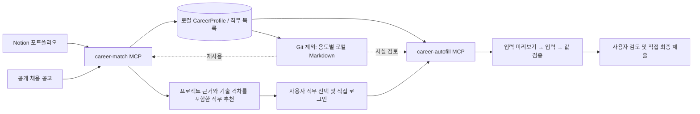
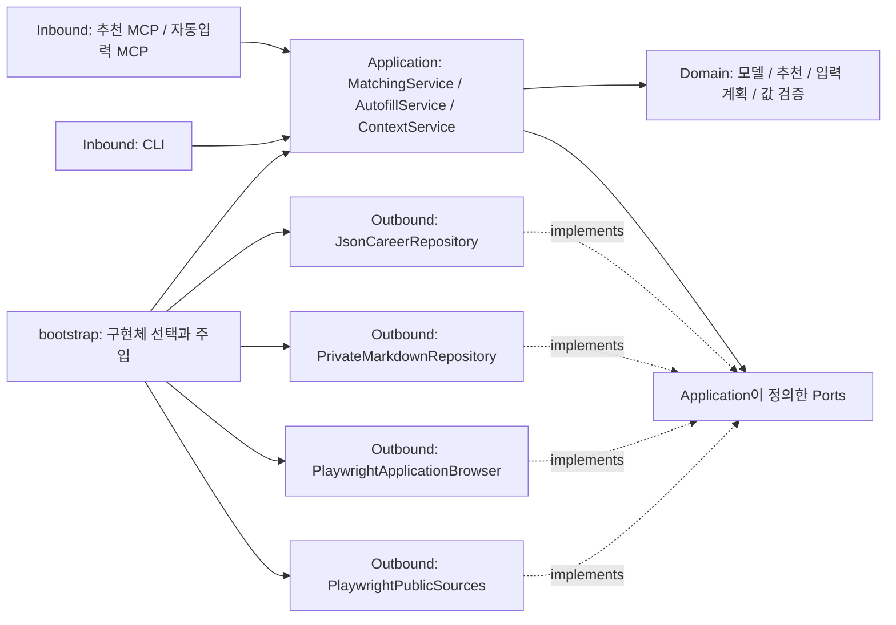

# career-autofill-agent
Bring your career profile. We'll handle the forms.

기존 Notion 포트폴리오를 바탕으로 지원할 직무를 찾고, 로그인 이후 채용 지원서의 기본 정보를 채우는 **Python + uv 기반 MCP 서버 2개**입니다.

## 구조

### 서비스 흐름



MCP 호스트(예: Codex)가 Notion의 자유로운 문서 구조를 읽고 `CareerProfile`로 정리합니다. 서버는 이 구조를 검증·저장합니다. 별도의 LLM API 키는 필요하지 않습니다. 원문에 없는 사실은 생성하지 않고, 사용자 확인이 필요한 값은 `unverified`로 남깁니다.

### 헥사고날 아키텍처

`domain`에 추천·입력 규칙을 두고, `application`은 포트로 저장소·브라우저를 사용합니다. MCP/CLI와 JSON/Playwright는 각각 inbound/outbound adapter이며, `bootstrap.py`가 구현체를 주입합니다.



화살표는 코드의 의존성 방향을 나타냅니다. `application`은 포트 인터페이스에 의존하고 실제 구현체는 `bootstrap.py`에서 주입합니다. 디렉터리와 확장 방법은 [아키텍처 문서](docs/architecture.md)에 정리했습니다.

## 설치와 실행

Python 3.12 이상과 [uv](https://docs.astral.sh/uv/guides/projects/)가 필요합니다.

```bash
uv sync
uv run playwright install chromium
uv run pytest -q
```

각 MCP 서버는 stdio로 실행합니다. MCP 호스트가 프로세스를 실행하고 표준 입력·출력으로 통신합니다.

```bash
uv run career-match-mcp
uv run career-autofill-mcp
```

Codex에는 [공식 MCP 설정 안내](https://learn.chatgpt.com/docs/extend/mcp?surface=cli)를 따라 두 서버를 등록합니다. 경로를 자신의 저장소 절대 경로로 바꾸세요. TOML 예시는 [examples/mcp-config.toml](examples/mcp-config.toml)에 있습니다.

```bash
codex mcp add career_match \
  --env CAREER_DATA_DIR=/absolute/path/career-autofill-agent/data \
  -- uv --directory /absolute/path/career-autofill-agent run career-match-mcp

codex mcp add career_autofill \
  --env CAREER_DATA_DIR=/absolute/path/career-autofill-agent/data \
  --env CAREER_BROWSER_DIR=/absolute/path/career-autofill-agent/.browser \
  -- uv --directory /absolute/path/career-autofill-agent run career-autofill-mcp
```

`.env.example`은 환경 변수 설명용입니다. `.env` 파일을 자동으로 읽지는 않으므로 MCP 호스트의 `env` 또는 셸 환경 변수로 전달하세요.

## 1. 직무 추천 MCP

| 도구 | 동작 |
| --- | --- |
| `read_portfolio(url)` | 공개 Notion 페이지의 렌더링된 본문과 링크 읽기 |
| `import_source_snapshot(document)` | 호스트 브라우저로 읽은 원문 저장 |
| `save_profile(profile)` / `get_profile()` | 출처와 확인 상태를 포함한 표준 프로필 저장·조회 |
| `get_reusable_context(section, refresh)` | 필요한 용도의 비공개 Markdown을 생성·재사용; 기본 `matching` |
| 공고 수집 도구 | 구현된 채용 사이트 어댑터로 신입 공고 수집 및 직무표 파싱 |
| `import_job_snapshot(document)` | 브라우저로 확인한 공고 직무표 파싱; rowspan/colspan 처리 |
| `save_jobs(jobs)` | 호스트가 원문에서 정리한 직무 저장 |
| `recommend_jobs(limit)` | 접수 중인 직무의 프로젝트 근거·기술 격차·확인 사항 반환 |

Notion 페이지가 로그인이나 공개 설정 문제로 읽히지 않으면 호스트 브라우저에서 확인한 내용을 `import_source_snapshot`으로 전달할 수 있습니다. 비공개 Notion API와 사용자 쿠키를 수집하지 않습니다.

현재 추천은 기술 주제와 직무내용을 비교하는 설명 가능한 키워드 방식입니다. 범용 인사 직무의 ‘AI 경험 우대’만으로 AI 개발 직무처럼 추천하지 않습니다. 점수는 관련성 지표이며 합격 확률이 아닙니다. 학력·병역 등 지원자격 중 확인되지 않은 조건은 함께 표시합니다. 마감일은 한국 시간으로 비교합니다.

현재 지원 범위는 구현된 채용 사이트 어댑터로 제한됩니다. 다른 사이트에 적용하려면 해당 사이트의 공고 파서·지원서 어댑터와 허용 URL 정책을 추가해야 합니다. 실제 검증에 사용한 기업명과 공고 사이트 주소는 문서에 공개하지 않습니다.

CLI로 표준 프로필과 직무 데이터를 가져오거나 추천을 다시 실행할 수 있습니다.

```bash
uv run career-autofill schema
uv run career-autofill import-profile examples/profile.example.json
uv run career-autofill import-jobs /path/to/jobs.json
uv run career-autofill import-job-snapshot /path/to/snapshot.json
uv run career-autofill recommend --limit 5
```

예시 프로필을 가져오면 현재 로컬 프로필이 교체됩니다. 실제 개인 데이터가 있다면 별도의 `CAREER_DATA_DIR`에서 예시를 실행하세요.

## 로컬 Markdown으로 정보 재사용

Notion이나 다른 경력 자료를 **처음에 읽어 출처가 있는 JSON으로 정리하고**, 이후에는 필요한 Markdown만 읽습니다. 기존 자동입력도 JSON을 직접 사용하므로 원문을 매번 다시 해석할 필요가 없습니다. 원문이 바뀌면 다시 확인하고 `save_profile`, `update_profile` 또는 `import-profile`로 JSON을 갱신합니다.

빈 수동 정리 양식을 만들고, 프로필 저장 후 용도별 문서를 생성합니다.

```bash
# 개인정보 없이 빈 로컬 양식 생성
uv run career-autofill init-context

# 원문에서 확인·정리한 표준 프로필 가져오기
uv run career-autofill import-profile /path/to/profile.json

# 프로젝트·기술·지원자격: 연락처와 기본 인적사항 제외
uv run career-autofill context --section matching

# 입력 검토용 정형 사실: 프로젝트 설명 제외
uv run career-autofill context --section autofill
```

기본 저장 위치는 `data/context/`입니다.

| 파일 | 용도 |
| --- | --- |
| `README.private.md` | 원문 위치·확인 시점·사용자 선호·미확인 사항을 수동으로 정리하는 양식 |
| `matching.private.md` | 프로젝트, 기술과 지원자격을 확인하는 추천용 문서 |
| `autofill.private.md` | 값·프로필 경로·출처·확인 상태를 확인하는 입력용 문서 |
| `*.private.json` | 프로필 지문, 문서 생성 시각과 내용 검증용 해시 |

프로필이 같으면 기존 Markdown을 재사용합니다. JSON 변경, 문서 손상·직접 수정 또는 `--refresh`가 있으면 다시 생성합니다. `--refresh`는 **로컬 문서만** 다시 만들며 Notion을 새로 읽지는 않습니다. 자동 생성 Markdown을 수정해도 JSON이나 지원서 입력값에 반영되지 않습니다. 수동 양식은 별도의 메모이며 MCP가 자동으로 사실로 가져오지 않습니다.

두 MCP 모두 `get_reusable_context`를 제공합니다. 추천 서버의 기본 용도는 `matching`, 자동입력 서버는 `autofill`입니다. 응답의 `cache_hit`, `elapsed_ms`, `character_count`로 재사용 여부와 로컬 처리 시간을 확인할 수 있습니다. MCP 호스트에는 다음처럼 요청합니다.

> 저장된 프로필이 있으면 get_reusable_context의 matching 문서부터 읽고 직무를 추천해줘. 원문을 변경했다고 알려주면 그때 다시 읽어 JSON을 갱신해줘. 현재 공고 마감과 지원 조건은 새로 확인해줘.

가상 데이터로 캐시 동작만 테스트하려면 별도 임시 디렉터리를 사용합니다. 이 예시는 실제 사이트에 접속하지 않습니다.

```bash
CAREER_DEMO_DATA_DIR="$(mktemp -d)"
CAREER_DATA_DIR="$CAREER_DEMO_DATA_DIR" uv run career-autofill import-profile examples/profile.example.json
CAREER_DATA_DIR="$CAREER_DEMO_DATA_DIR" uv run career-autofill context --section matching
CAREER_DATA_DIR="$CAREER_DEMO_DATA_DIR" uv run career-autofill context --section matching
# 첫 조회: cache_hit=False / 같은 프로필의 다음 조회: cache_hit=True
```

`data/`, `*.private.md`, `*.private.json`은 Git에서 제외됩니다. 생성기는 Git 작업 트리 내부의 출력 경로가 이미 추적 중이거나 제외되지 않은 경우 읽기·쓰기를 거부합니다. 디렉터리는 0700, 파일은 0600 권한으로 생성합니다. `git add -f`는 제외 규칙을 우회하므로 개인 파일에는 사용하지 마세요. Markdown에는 비밀번호·인증번호·세션 쿠키를 넣지 않습니다.

최적화 우선순위와 측정 범위는 [성능 문서](docs/performance.md)를 참고하세요.

## 2. 기본 자동입력 MCP

| 도구 | 동작 |
| --- | --- |
| `open_application(job_url, mode)` | 선택한 공고 열기; `new`는 지원하기, `existing`은 지원서 수정 |
| `inspect_application()` | 사용자 로그인 이후 실제 입력 필드 읽기 |
| `update_profile(profile)` | 사용자가 확인한 누락 정보 반영 |
| `get_reusable_context(section, refresh)` | 입력 검토에 필요한 비공개 정형 사실 재사용; 기본 `autofill` |
| `preview_autofill(mappings)` | 필드·입력값·출처 및 미입력 사유를 포함한 계획 생성 |
| `apply_autofill(plan_id)` | 같은 브라우저에서 계획 실행 후 값을 다시 읽어 검증 |
| `preview_from_snapshot(url, fields, mappings)` | 호스트 브라우저의 로그인 세션에서 읽은 필드로 입력 계획 생성 |
| `verify_from_snapshot(plan_id, url, fields)` | 호스트가 실행한 입력과 기존 값 보존 여부를 새 화면 정보로 검증 |
| `close_browser()` | 검토를 마친 전용 브라우저 닫기 |

순서는 다음과 같습니다.

1. 추천 중 사용자가 **한 공고**를 선택합니다.
2. `open_application`이 전용 브라우저를 열고 사용자에게 로그인을 넘깁니다. 기존 지원서는 `mode="existing"`으로 엽니다.
3. 사용자가 동의·로그인·인증을 직접 완료한 후 지원서 입력 화면을 엽니다.
4. `preview_autofill`이 화면 조회와 계획 생성을 함께 수행합니다. 반복 학력 등의 명시적 매핑이 필요하면 먼저 `inspect_application`으로 필드 ID를 확인합니다.
5. `apply_autofill` 한 번으로 페이지의 확인된 빈 필드를 묶어 채우고, 결과와 기존 값 보존을 검증합니다.
6. 사용자가 나머지 항목과 전체 결과를 검토하고 직접 최종 제출합니다.

이미 Codex 브라우저에서 로그인했다면 **호스트 브라우저 방식**을 사용합니다. `uv run career-autofill form-scanner`로 출력하는 공통 스크립트(`adapters/outbound/form_dom.py`)를 읽기 전용 DOM 조회로 실행하고 각 필드에 `id=f{frame}:{index}`, `frame`을 붙여 `preview_from_snapshot`에 전달합니다. 호스트는 화면이 미리보기와 같은지 확인한 뒤 반환된 actions만 개별 대상 확인을 포함한 하나의 브라우저 실행에 묶고, 새 스냅샷 한 번으로 `verify_from_snapshot`을 호출합니다. URL·프로필·입력값·기존 값이 바뀌면 검증에 실패하고 새 계획이 필요합니다. 세션 쿠키를 추출하거나 전용 Chromium으로 옮기지 않습니다. `verify_from_snapshot`은 화면 값을 검증하며 서버 저장 여부까지 확인하지 않으므로 호스트가 임시저장 및 새로고침 후 유지 여부를 별도로 확인해야 합니다.

전용 브라우저의 실행 단계는 필드마다 폼 전체를 재조회하던 방식을 입력 전후 전체 조회 2회와 개별 필드 확인으로 바꿨습니다. 가상 폼 100개 입력에서도 전체 조회가 2회임을 테스트로 검증합니다. 실제 사이트의 전체 소요 시간은 검색 위젯·네트워크·사용자 확인 시간의 영향도 받습니다.

기본 지원 대상은 HTML input/select/textarea의 연락처·학력·병역 등 정형 정보입니다. 모르는 값, 날짜 정밀도가 맞지 않는 값, 정확히 일치하지 않는 선택지는 건너뜁니다. 지원서에서 관찰한 연월 필드는 `YYYY-MM` 사실을 `YYYY.MM`로 변환하며 날짜의 일자를 생성하지 않습니다. 반복되는 학교명 등은 화면의 필드 ID와 `education.0.school` 같은 프로필 경로를 명시적으로 연결해야 합니다. 기존 값은 덮어쓰지 않습니다. 동의 체크박스·비밀번호·민감한 별도 확인 항목, 파일 업로드와 최종 제출은 자동 처리하지 않습니다.

학교·전공 검색과 커스텀 드롭다운은 현재 전용 브라우저 MCP가 직접 처리하지 않습니다. 호스트가 출처와 화면의 선택지를 비교해 처리하거나 사용자가 직접 입력해야 합니다. 호스트 방식에서는 커스텀 선택, 단계 이동과 임시저장도 해당 화면에서 처리해야 합니다. 전체 지원서의 무인 완성을 보장하는 범용 어댑터는 아닙니다.

로그인 화면에서는 개인정보 자동입력을 실행하지 않습니다. 미리보기 후 화면이나 프로필이 바뀌면 계획을 다시 만들어야 합니다. 일부 필드 입력에 실패한 계획도 재사용하지 않습니다. 입력 자체가 채용 사이트의 자동 저장을 유발할 수 있습니다.

## 현재 문제점과 개선 방향

실제 브라우저 테스트에서 자동입력 속도가 다소 느렸습니다. 전체 폼 재조회 횟수는 줄였지만, 화면 해석과 브라우저 도구 호출, 커스텀 위젯의 응답 대기, 입력 결과 검증에서 발생하는 지연을 더 줄여야 합니다. 각 구간의 소요 시간은 아직 분리해 측정하지 않았으므로 병목을 먼저 확인해야 합니다.

- **모델 선택 최적화:** 화면 해석을 담당하는 MCP 호스트에서 Jev 모델을 사용하는 등의 방안을 검토합니다. 같은 입력에서 응답 시간과 필드 매핑 정확도를 비교해 적용 여부를 결정합니다. 현재 도입하거나 성능 개선 효과를 검증한 상태는 아닙니다.
- **원문 재해석 줄이기:** 용도별 로컬 Markdown을 재사용합니다. 프로필 변경은 지문으로 감지하며, 원문 변경 여부는 따로 확인해야 합니다.
- **브라우저 호출 최소화:** 호스트 브라우저에서도 페이지 단위 입력을 묶어 실행하고, 화면 변경이 없는 구간의 중복 조회와 도구 호출을 줄입니다.
- **사이트별 위젯 처리:** 반복되는 학교·전공 검색과 드롭다운 처리를 어댑터에 추가해 매번 화면을 해석하는 작업을 줄입니다.
- **구간별 성능 측정:** 모델 응답, 폼 조회, 입력, 위젯 대기, 검증 시간을 각각 기록해 최적화 전후를 비교합니다. 기존 값 보존과 입력 정확도도 함께 확인합니다.

## 데이터와 검증

`data/`에는 개인 프로필·원문·공고·입력 계획·검증 결과를 저장하고, `.browser/`에는 전용 브라우저의 로그인 상태를 보관합니다. 둘 다 Git에서 제외됩니다. 새 데이터 디렉터리는 0700, JSON 파일은 0600 권한으로 생성합니다. 예시와 테스트에는 가상의 지원자만 사용합니다.

지원서 캡처와 결과 파일은 Git에서 제외된 `artifacts/`에 보관하세요. 개인 데이터가 필요 없어지면 `data/`, `.browser/`, `artifacts/`를 삭제합니다. 소스·문서에 실제 지원자의 정보나 개인 페이지 링크를 넣지 마세요. 커밋 작성자 이름·이메일도 공개 이력에 포함되므로 저장소의 Git 설정을 먼저 확인하세요.

```bash
uv run ruff check src tests
uv run ruff format --check src tests
uv run pytest -q
```

검증에는 MCP 두 서버의 실제 stdio 연결, 출처가 있는 프로필 공유, 병합 셀 공고 파싱, 한국 시간 마감 처리, 미확인 값·기존 값 보존, 새 지원/기존 지원서 수정 팝업의 로그인 인계, 입력 이벤트와 값 검증, 연월 포맷, 변경된 입력 계획 거부, 호스트 브라우저의 입력 및 기존 값 재검증이 포함됩니다. 브라우저 자동입력 테스트는 모든 네트워크 요청을 가로채 가상의 폼으로 응답하므로 실제 지원서를 만들거나 제출하지 않습니다.

헥사고날 계층 의존성과 조회 횟수 회귀 테스트를 포함한 자동 검증 37개를 제공합니다. 실제 지원자의 프로필·지원 내역·캡처는 저장소에 포함하지 않습니다.
