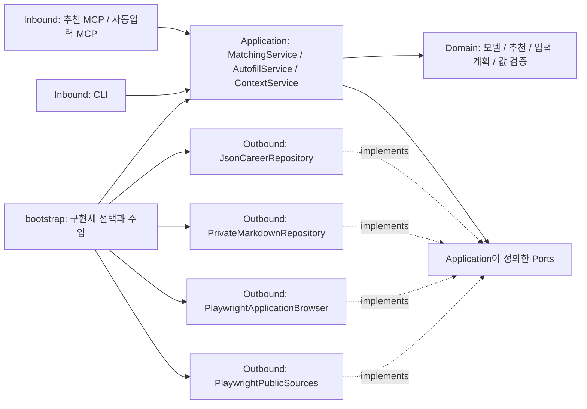

# 헥사고날 아키텍처

직무 추천과 자동입력의 규칙을 MCP·브라우저·파일 저장소에서 분리한다. 두 MCP 서버는 별도 프로세스로 실행하며, 같은 JSON 저장소를 통해 출처가 있는 프로필을 공유한다.



의존성 화살표는 코드가 참조하는 방향이다. `application`은 포트 인터페이스만 알고, 실제 구현체는 `bootstrap.py`에서 주입한다. 런타임 호출은 포트를 통해 outbound adapter로 전달된다.

## 디렉터리와 책임

```text
src/career_autofill/
├── domain/
│   ├── models.py             # 출처, 프로필, 직무, 폼, 입력 계획
│   ├── matching.py           # 프로젝트 근거에 따른 직무 점수
│   ├── planning.py           # 필드 매핑, 날짜 변환, 기존 값 보존
│   ├── verification.py       # 계획 변경·재사용 거부, 입력 결과 검증
│   ├── context.py            # 용도별 Markdown 표현과 출처·확인 상태
│   └── policies.py           # 허용 URL, 한국 시간
├── application/
│   ├── ports.py              # 저장소, 자료 조회, 브라우저 계약
│   ├── matching.py           # 읽기 → 표준 프로필 저장 → 직무 추천
│   ├── context.py            # 프로필 지문 확인 → 로컬 문서 재사용·갱신
│   └── autofill.py           # 계획 → 계획 소비 → 입력 → 검증 결과 저장
├── adapters/
│   ├── inbound/
│   │   ├── match_mcp.py      # 추천 MCP 스키마와 유스케이스 호출
│   │   ├── autofill_mcp.py   # 자동입력 MCP 스키마와 유스케이스 호출
│   │   └── cli.py            # 명령행 입력과 결과 출력
│   └── outbound/
│       ├── json_repository.py    # JSON 직렬화, 파일명, 권한, 원자적 저장
│       ├── private_markdown.py   # 비공개 Markdown, Git 제외 확인, 내용 검증
│       ├── playwright_browser.py # 로그인 인계와 실제 폼 조작
│       ├── form_dom.py           # 읽기 전용 폼·개별 필드 조회
│       ├── public_sources.py     # 공개 Notion·채용 페이지 읽기
│       └── db_job_parser.py      # 채용 공고 표와 병합 셀 파싱
└── bootstrap.py              # 환경 설정과 구현체 조립, 실행 진입점
```

`domain`은 MCP·Playwright·파일 시스템에 의존하지 않는다. `application`은 domain과 자신이 정의한 ports에만 의존한다. Inbound adapter와 outbound adapter는 서로 참조하지 않는다. `tests/test_architecture.py`가 이 규칙을 검사한다.

저장소를 SQLite로 바꾸려면 repository port를 구현하고 bootstrap의 주입 대상을 교체한다. 다른 브라우저를 사용하려면 `ApplicationBrowser` port를 구현한다. 다른 채용 사이트의 원문은 `JobSource` port에서 `JobRole`로 변환하고, 지원하는 사이트 정책도 함께 확장한다. 추천·입력 규칙은 재사용한다.

## 자동입력과 조회 횟수

전용 브라우저 방식은 `preview_autofill` → `apply_autofill`의 페이지 단위 호출을 사용한다. 미리보기 자체가 화면을 읽으므로 명시적 매핑이 필요하지 않다면 별도의 `inspect_application` 호출을 생략할 수 있다.

실행 단계에서는 전체 폼을 입력 전에 한 번, 입력 후에 한 번 조회한다. 각 필드를 쓰기 직전에는 해당 컨트롤만 다시 읽어 이름·종류·라벨·기존 값·활성 상태 등을 비교한다. 값 입력은 Playwright의 `fill` / `select_option`을 사용해 정상 입력 이벤트를 유지한다. 입력 도중 필드가 바뀌면 배치를 중단하며, 마지막 전체 조회에서 기존 값 보존도 확인한다.

| 실행 시 전체 폼 조회 | 이전 구현 | 현재 구현 |
| --- | --- | --- |
| 입력 필드 N개 | N + 1회 | 2회 |
| 입력 필드 100개 | 101회 | 2회 |

개별 필드 확인과 입력·읽기 검증은 계속 수행한다. 이 수치는 전체 DOM 조회 횟수이며 실제 채용 사이트의 입력 시간 배율을 뜻하지 않는다. 네트워크, 화면 렌더링과 커스텀 검색 위젯의 대기 시간은 별도로 남는다.

호스트 브라우저 방식은 동일한 domain 계획·검증 규칙을 사용한다. 호스트가 폼 스냅샷 한 번으로 `preview_from_snapshot`을 호출하고, 개별 대상 확인을 포함한 여러 입력을 하나의 브라우저 실행에 묶은 뒤, 새 스냅샷 한 번으로 `verify_from_snapshot`을 호출한다. 커스텀 위젯 때문에 필드 구성이 바뀌면 새 계획을 만든다. 호스트가 수행하는 브라우저 호출 횟수는 MCP 서버에서 강제할 수 없다.

공통 조회 스크립트는 다음 명령으로 출력한다. 반환된 함수를 읽기 전용 DOM 조회로 실행한 후 각 항목에 `frame`과 `id=f{frame}:{index}`를 붙인다.

```bash
uv run career-autofill form-scanner
```

## 호환성과 검증

MCP 도구 이름·입력 파라미터, 실행 명령 3개와 프로필·직무·입력 계획의 기존 JSON 파일 형식은 유지한다. Python 모듈의 import 경로는 위 구조로 이동했다. CLI와 MCP의 추천 처리는 같은 유스케이스를 사용해 동일한 보고서 형식으로 저장한다.

브라우저 입력 전에 계획을 소비한 상태로 저장하므로 부분 실패나 연결 끊김이 발생해도 재사용하지 않는다. 로그인·동의·최종 제출은 사용자가 직접 처리한다.

37개 테스트에는 계층 의존성, 메모리 포트로 실행하는 유스케이스, 두 MCP의 실제 stdio 연결 및 도구 목록 호환성, 기존 입력·로그인 정보 보존, 변경된 계획 거부, 100개 입력 시 전체 조회 2회, 입력 중 다음 필드가 변경될 때 중단하는 경우가 포함된다. 비공개 컨텍스트는 연락처 제외, 변경·손상에 따른 갱신, Git 추적·제외 확인과 심볼릭 링크 거부도 검증한다. 모든 브라우저 회귀 테스트는 네트워크 요청을 가로채 가상 페이지로 응답한다.

## 비공개 컨텍스트 재사용

`ContextService`는 `ProfileRepository`에서 기준 JSON을 읽고 `ContextRepository`로 Markdown을 재사용한다. 버전과 프로필 지문이 일치하면 이전 문서를 반환하고, 변경되면 domain의 renderer로 다시 생성한다. 브라우저·Notion 조회·모델 호출은 이 유스케이스에 포함되지 않는다.

`PrivateMarkdownRepository`는 내용 검증용 해시를 확인하고 Git 작업 트리 내부의 경로는 추적되지 않고 제외되어 있어야 읽거나 쓴다. 파일은 0600 권한으로 원자적으로 저장한다. Markdown은 표현용 캐시이며 자동입력의 기준 원본은 JSON이다. 상세한 재사용 순서와 성능 측정 범위는 [성능 문서](performance.md)를 참고한다.
